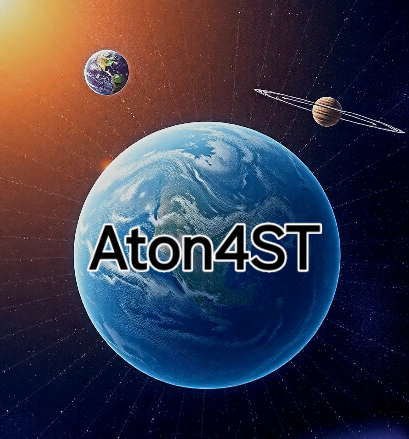

  *Aton4ST Team*
# PRC Resource Library

This repository contains resources related to the PRC Resource Library project.  The process involves several key steps:

## Project Workflow

1. **YAML File Classification:**  YAML files are classified and organized within this repository.  Further details on the classification scheme and directory structure can be found in Main foldee. 

2. **CSV Upload to Web Application:**  Users can upload their CSV files to the designated web application for access and processing.  Instructions for uploading can be found: 'https://prcrs.blogspot.com/p/lambda-ds.htm'

3. **CSV Upload and Data Search (Service):** The uploaded CSV file is then processed by the service.  Users can perform searches against the data within the CSV.  Details on the service API or usage instructions are available: 'https://prcrs.blogspot.com/p/lambda-ds.html'. 

4. **AI Chatbot Integration:**  An AI chatbot is integrated to assist users in researching, analyzing, and verifying user data from the internet.  Information on how to interact with the chatbot and its capabilities can be found, `https://prcrs.blogspot.com/p/lambda-ds.html'.

## Repository Structure
Datasets/  (Root directory - Matches the repo name)

├── raw/         # Original, unprocessed data files (often large)

│ ├── classified_data.csv
│ ├── classified_data.json
│ └── ...
|
├── processed/   # Data that has been cleaned, transformed, or prepared
|
│ ├── classified_data.csv
│ ├── classified_data.pkl  (Pickle files are common for Python data)
|
│ └── ...
├──intermediate/ # Temporary files created during processing (can be deleted later)
|
│ └── temp_data.csv
├── scripts/      # Code for data processing, analysis, or model training
|
│ ├── ExploreSpaceSci.ipynb
│ ├── RCchatbot.ipynb
│ └── ...
├── notebooks/    # Colab Notebooks for exploration and experimentation
|
│ ├── ExploreSpaceSci.ipynb
│ ├── RCchatbot.ipynb
│ └──  CMB_angular_power_spectrum.ipynb
|
├── data/         # Smaller, derived datasets used for specific purposes
│ ├── classified_data.csv
│ ├── classified_data.csv
│ └── ...
├── models/       # Saved machine learning models
│ ├── AIchatbot.pkl
│ └── AIchatbot.h5 
├── outputs/      # Results, visualizations, or reports
|
│ ├── figures/
│ |  └── 4177381372.jpg
│ ├── tables/
│ │   └── classified_data.csv
│     └── Aton4ST prototype.pdf
├── docs/ # Documentation files
│ ├── README.md
│ └── CONTRIBUTING.md
├── requirements.txt # List of Python dependencies
|
└── ...           # Other files

## Contributing

Contributions are welcome!  Please see the [CONTRIBUTING.md](CONTRIBUTING.md) file for guidelines.

## License

Personal use

  
  *Click the thumbnail to watch the video.*

